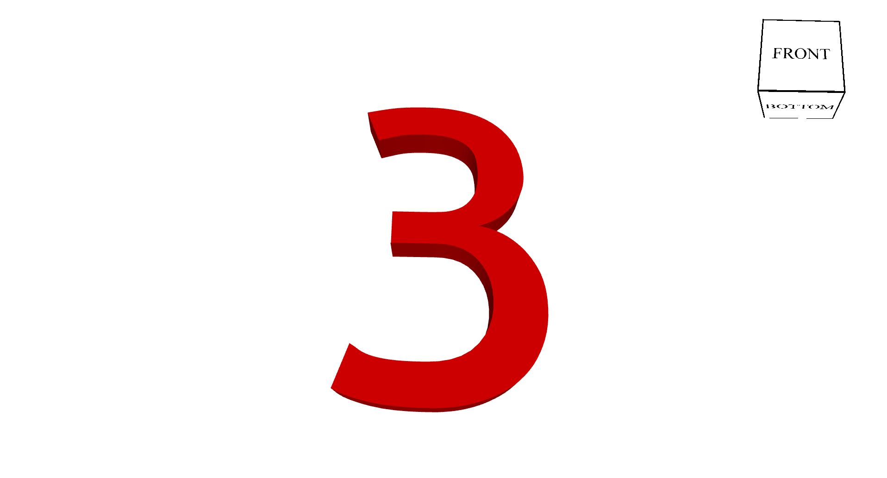

# Fornjot Text

## About

Fornjot Text is a library for creating text in [Fornjot](https://www.fornjot.app/), a CAD kernel written in Rust.

This currently very much an experiment. Feedback is welcome!

## Usage

For now, see the [tests](tests/test_extrusion.rs). More examples coming soon!

## Limitations

* Currently supports only stencil fonts
  * Right now all regions returned are exterior regions. Any glyphs with interiors will fail to extrude. Since stencil fonts have no interiors, they work well.
* Rendering using Fornjot is slow - try exporting to an STL and viewing in another viewer.

## Future

* Support for interior polygons
* Support string generation (currently only single glyph at a time)
* Reduce number of vertices used

## License

Licensed under either of [Apache License, Version 2.0](LICENSE-APACHE) or [MIT license](LICENSE-MIT) at your option.
